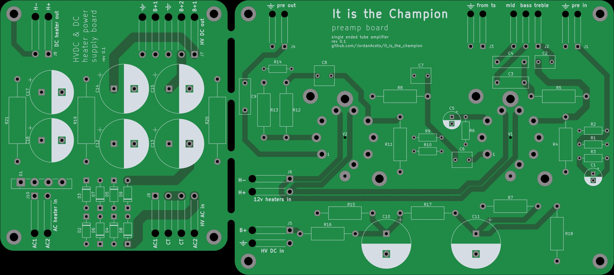

# Kicad documents for the schematics and PCB layout

## The system consists of:
- ### Power supply PCB
- ### Preamp PCB
- ### Point to point wired power amp
- ### Chassis mount components (transformers, jacks, pots, etc)

The preamp and power supply pcbs are connected with breakaway mousebites.

